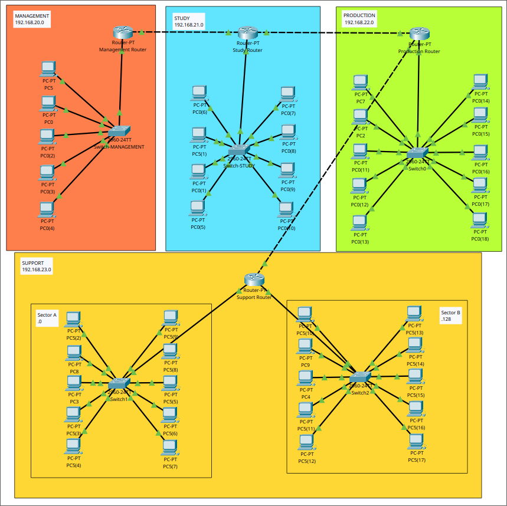

# Project :  Secure Network Design

## The Task :

We were tasked to design a network architecture with the following components:

An Active Directory

A DNS server

A DHCP server

A DMZ implemented through VLANs and ACLs

An iSCSI storage server

Four network sectors:

Management/Secretariat (5 workstations)

Study (8 workstations)

Production (10 workstations)

Support (2 sectors, 10 workstations each)

## The Design :

### Overview of the network


### The four departments



### IP Addressing

All of the computers are automatically assigned a local IP Address by the DHCP server. The IP address assigned will be in the range of the pool of addresses in the DHCP server associated with the department.

It is worth noting that all of the routers in each department have the static IP addresses of the first usable host address in their respective subnet, and are not assigned IP addresses dynamically by the DHCP server. This is important because routers need to keep the same IP address in order for the end devices in the subnet to have a valid default gateway.

## DHCP


Here is the configuration of the DHCP server. It will automatically assign IP addresses from different pools of addresses associated with the Default Gateway of each department. The range starts from the Start IP Address, to the last IP address in the network allowed by the Subnet Mask.

In order for the DHCP requests to work when the DHCP server is in another network, we must apply the following command on each department router interfaces:

````
Router(config-if)#ip helper-adress 192.168.30.2
````

This command specifies that a DHCP server (192.168.30.2) exists and the router stores its address for future DHCP requests.
Now when end devices make DHCP requests, the requests will be forwarded directly to the DHCP server address.

### Topology


Unlike the star topology where all the routers are all connected to one single router, here all the routers are connected to multiple routers between each other. It’s a little more complex to set up and expand in the future, but this allows fault tolerance in case any of the cables breaks or any router ceases to work. The network would still be able to work partially.

## Routing


The routing table on the left is the one configured in the Management Router. Each department router has a similar routing table. The network addresses from each department have a next hop of 20.0.0.2. This means that whenever a packet is sent to one of the other department networks, it will be sent through the Study Router before it arrives in the right network.

We also assign 0.0.0.0/0 via 10.0.0.1. This means we forward every packet whose destination is not in the four departments, and we pass it via the server router (10.0.0.1), which happens to be the central router of the whole network.

## The servers and the DMZ


This part of the network is where all the servers are. While this can look like one single network, it is in reality two different networks. The DNS server and Internet router are physically connected to the same switch as the other servers, but the switch actually uses two VLANs to separate them logically. As shown below, the green represents the DMZ VLAN, and the red the Server VLAN. This setup allows all the servers to be physically in the same place, but allows the DNS server to be the only server in the Demilitarized Zone. We only allows the DNS server to be in the DMZ because people from outside the LAN would need this service. There are no reason for people from the outside to access the DHCP, RADIUS and the FTP servers, this is why these servers are behind the second layer Firewall (Server Router), while the DNS server is only behind the first layer firewall (Router Internet).


This is the physical representation


This is the logical representation

| Sector  | IP Subnet       | VLAN | IP Range                    | Purpose                        |
| -       | -               | -    | -                           | -                              |
| DMZ     | 192.168.40.0/24 | 10   | 192.168.40.1-192.168.21.254 | DMZ for public-facing services |
| Servers | 192.168.30.0/24 | 20   | 192.168.30.1-192.168.30.254 | Servers                        |

## Security

### RADIUS


ACLs as firewall

Demilitarized Zone (DMZ) using VLANs

## Conclusion

This network design provides a structured approach to IP addressing, VLAN configuration, device setup, security measures, and cost estimation. It aims to ensure efficient network operations while prioritizing security and scalability.

Group project  : Jean P , Pablo , Cristian Sandru .


